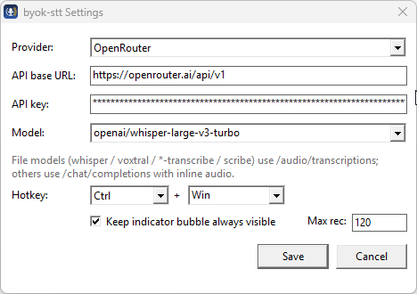

<div align="center">


# byok-stt

**Windows 按键说话语音输入工具 — 带上你自己的 AI 密钥。**

按住快捷键、说话、松开 — 文字自动出现。

[](https://github.com/Jackychan122/byok-stt/releases)
[](LICENSE)


[English](README.md) | [繁體中文（香港）](README.zh-HK.md) | 简体中文


</div>

---

## 为什么选择 byok-stt？

大部分语音输入工具都把你锁定在单一云服务。**byok-stt 兼容任何
OpenAI 格式的语音转文字服务** — OpenRouter、OpenAI、Groq、Google Gemini、
Mistral、ElevenLabs，甚至你自建的端点。你只需带上 API 密钥，其他交给程序。
音频永不落盘，整个程序只是一个约 1 MB 的可执行文件。

## 功能

- **全局快捷键** — 在任何地方按住、说话、松开 → 文字自动粘贴到当前窗口
  （并复制到剪贴板）。默认 `Ctrl+Win`（Windows）、`Cmd+Space`（macOS）、
  `Ctrl+Space`（Linux），可完全自定义。
- **任意服务提供商** — 内置 OpenRouter、OpenAI、Groq、Google Gemini、
  Mistral、ElevenLabs 预设，也可自行编辑 API 网址接入任何 OpenAI 兼容端点。
- **屏幕指示气泡** — 只在录音（红色）或转写（黄色旋转）时出现的小圆点。
  可拖动移动、可设置常驻显示；左键开始／停止录音，右键打开设置。
- **系统托盘图标** — 状态颜色变化，左键切换录音，右键菜单。
- **安全防护** — 可设置最长录音时间、单实例提示、自动释放卡住的修饰键。
- **隐私优先** — 音频只存在于内存，直接发送到你选择的服务。
  不存储、不追踪、不上报。
- **轻量** — 单一可执行文件，约 10 MB 内存。

## 快速开始

1. 到 [**Releases**](https://github.com/Jackychan122/byok-stt/releases) 下载
   `byok-stt-v*-windows-x64.zip` 并解压。
2. 双击 **`byok-stt.exe`** — 系统托盘会出现麦克风图标。
3. 右键点击托盘图标 → **Settings**。
4. 粘贴你的 API key、选择 Provider 与 Model → **Save**。
   （获取密钥：[OpenRouter](https://openrouter.ai/keys) ·
   [OpenAI](https://platform.openai.com/api-keys) ·
   [Groq](https://console.groq.com/keys) ·
   [Gemini](https://aistudio.google.com/apikey) — 任何 OpenAI 兼容端点都可
   选 **Custom** 自行填入网址。）
5. 按住 **Ctrl+Win** 说话，松开 — 文字自动粘贴 ✨

<div align="center">

&nbsp;&nbsp;

</div>

## 设置说明

| 设置 | 默认值 | 说明 |
|---|---|---|
| Provider | OpenRouter | 预设：OpenAI、Groq、Gemini、Mistral、ElevenLabs、Custom |
| API base URL | 按 Provider | 任何 OpenAI 兼容端点 |
| API key | — | 保存在本机 `%APPDATA%\byok-stt\config.json` |
| Model | 按 Provider | 可编辑下拉菜单，附建议列表 |
| Hotkey | Ctrl+Win | 修饰键（Ctrl/Alt/Shift/Win）+ 按键（Space、A–Z、0–9、F1–F12）|
| 常驻显示气泡 | 关 | 灰色空闲气泡固定在屏幕上 |
| 最长录音（秒）| 120 | 5–3600；看门狗会自动停止过长录音 |

## Provider 与模型

| Provider | 密钥申请页 | 建议模型 |
|---|---|---|
| OpenRouter | https://openrouter.ai/keys | `openai/whisper-large-v3-turbo` |
| OpenAI | https://platform.openai.com/api-keys | `gpt-4o-mini-transcribe` |
| Groq | https://console.groq.com/keys | `whisper-large-v3-turbo` |
| Google Gemini | https://aistudio.google.com/apikey | `gemini-2.5-flash-lite` |
| Mistral | https://console.mistral.ai/apikeys | `voxtral-small-24b-2507` |
| ElevenLabs | https://elevenlabs.io/app/settings/api-keys | `scribe_v1` |

文件型模型（`whisper`、`voxtral`、`*-transcribe`、`scribe`）会发送到
`{base}/audio/transcriptions`；其他模型走 `{base}/chat/completions`
内联音频。

## 操作说明

| 操作 | 效果 |
|---|---|
| 按住快捷键 + 说话 | 开始录音（红色气泡）|
| 松开按键 | 转写（黄色旋转）→ 自动粘贴文字 |
| 托盘／气泡左键 | 开始／停止录音 |
| 拖动气泡 | 移动位置（自动记忆）|
| 气泡右键 | 设置菜单 |
| 托盘图标右键 | Settings、Exit |
| 重复启动程序 | 弹出「已在运行」提示（单实例）|

## 从源码构建

需求：Windows 10/11 上的 [Rust](https://rustup.rs/)。

```powershell
git clone https://github.com/Jackychan122/byok-stt.git
cd byok-stt
powershell -ExecutionPolicy Bypass -File scripts\install.ps1
```

脚本会构建可执行文件、安装到 `%LOCALAPPDATA%\byok-stt` 并创建开始菜单快捷方式。
不需要管理员权限。

## 平台支持

目前完整支持 Windows 10/11。快捷键与配置层与操作系统无关
（各平台默认：macOS `Cmd+Space`、Linux `Ctrl+Space`），macOS/Linux
后端在规划中 — 需要不同的全局钩子、音频采集与粘贴实现
（欢迎贡献）。

## 隐私

- **音频永不写入磁盘** — 只存在于内存，直接发送到你配置的服务，
  转写完成立即释放。
- 配置、日志与气泡位置保存在 `%APPDATA%\byok-stt\`。
- 没有遥测、没有分析、没有回传。

## 常见问题

- **没有文字粘贴** — 查看托盘通知或 `%APPDATA%\byok-stt\log.txt`
  的错误信息（密钥错误、网络问题等）。
- **Windows 键好像「卡住」** — 程序会在每次结束后自动强制释放
  Win/Shift/Alt；如果真的遇到，按一下 `Win` 键即可复位。
- **搜索找不到图标** — 重新运行 `scripts\install.ps1` 刷新
  开始菜单快捷方式。

## 许可证

[MIT](LICENSE) © byok-stt contributors
